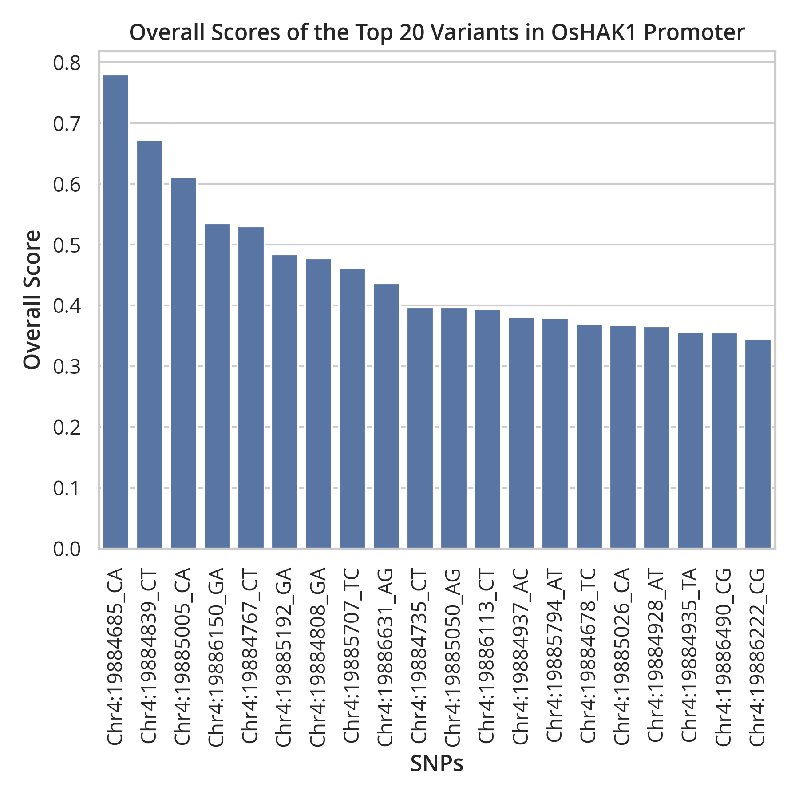
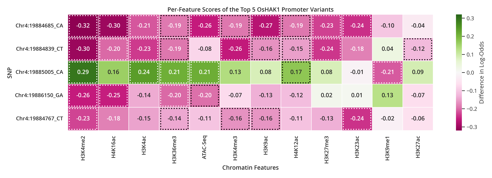

# Analyze Results

This walkthrough demonstrates how to prioritize variants based on their predicted scores and investigate the chromatin features contributing to each prediction.

## 1. Rank Variants by Overall Score

Rank all variants according to their **Overall Score**.

```bash
python -m scripts.analysis.prioritization.rank \
    --scores .data/hak1/scores.tsv \
    --snp_list .data/hak1/snp_list.tsv \
    -o .analysis/hak1/ranked
```

This generates:

```
.analysis/hak1/ranked/top_variants.tsv
```

The output contains all **132 OsHAK1 promoter variants** ranked in descending order of their Overall Scores.

### Retrieve the Top 20 Variants

To retain only the highest-ranking variants, specify the `--top` option.

```bash
python -m scripts.analysis.prioritization.rank \
    --scores .data/hak1/scores.tsv \
    --snp_list .data/hak1/snp_list.tsv \
    -o .analysis/hak1/ranked \
    --top 20
```

This generates:

```
.analysis/hak1/ranked/top20_variants.tsv
```

### Visualize the Top 20 Variants

Generate a bar plot of the highest-ranking variants.

```bash
python -m scripts.analysis.visualize.prioritization.top_variants \
    -i .analysis/hak1/ranked/top20_variants.tsv \
    -o .figures/hak1/ranked/top20_variants.png \
    --title "Overall Scores of the Top 20 Variants in OsHAK1 Promoter"
```

This generates:
```
.figures/hak1/ranked/top20_variants.png
```

**Expected Output**:  


## 2. Analyze Per-Feature Scores

The Overall Score summarizes the predicted chromatin changes across all features. To understand which chromatin features contribute to each prediction, we can examine the **Per-Feature Scores**.

For this example, we will analyze the top five variants.

### Generate the Per-Feature Score Matrix

```bash
python -m scripts.analysis.prioritization.per_feature_scores \
    --scores .data/hak1/scores.tsv \
    --snp_list .data/hak1/snp_list.tsv \
    -o .analysis/hak1/per_feature \
    --top 5
```

This generates:

```
.analysis/hak1/per_feature/per_feature_scores_top5.tsv
```

### Visualize the Per-Feature Scores

```bash
python -m scripts.analysis.visualize.prioritization.per_feature_scores \
    -i .analysis/hak1/per_feature/per_feature_scores_top5.tsv \
    -o .figures/hak1/per_feature/top5.png \
    --threshold_dir .data/stat_sig/1000/per_feature \
    -t "Per-Feature Scores of the Top 5 OsHAK1 Promoter Variants" \
    --height 5
```

This generates:

```
.figures/hak1/per_feature/top5.png
```

The plot displays the predicted chromatin changes for each variant across all chromatin features. Features that exceed the empirical significance thresholds are annotated automatically when the `--threshold_dir` option is provided.

> **Note**  
> `.data/stat_sig/1000/per_feature` refers to the `per_feature/` directory from the empirical background distribution for the **1000 bp** RiSPICE adapter. If you are using a different adapter (e.g., 500 bp or 750 bp), specify the corresponding `per_feature/` directory instead.

**Expected Output:**  


### Interpreting the Heatmap

The heatmap summarizes the predicted chromatin changes for the top five OsHAK1 promoter variants.

- **Rows** correspond to the selected SNPs.
- **Columns** correspond to the 12 predicted chromatin features.
- **Green** cells indicate that the alternate allele is predicted to ***increase*** the corresponding chromatin feature.
- **Magenta** cells indicate that the alternate allele is predicted to ***decrease*** the corresponding chromatin feature.
- A **dotted outline** indicates that the Per-Feature Score exceeds the empirical significance threshold (0.05 by default).
- Chromatin features are ordered by the **mean absolute Per-Feature Score** across the displayed variants, placing the most strongly affected chromatin features on the left.

## Next

After identifying the highest-ranking variant, continue to **Mutagenesis** to perform *in silico* saturation mutagenesis and examine the predicted effects of every possible nucleotide substitution within the surrounding genomic region.

⬅️ **Previous:** [Run the Pipeline](Run-the-Pipeline.md)

➡️ **Next:** [*In Silico* Saturation Mutagenesis](Mutagenesis.md)