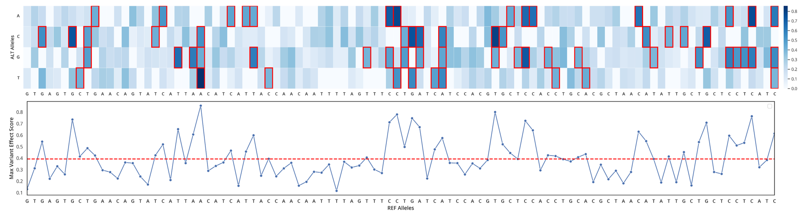

# *In Silico* Saturation Mutagenesis

This walkthrough demonstrates how to perform *in silico* saturation mutagenesis on the highest-ranking variant identified in the OsHAK1 promoter.

For this tutorial, we will analyze **Chr4:19884685_CA**, the top-ranked variant from the previous walkthrough.

## 1. Prepare the Input

Generate all possible single-nucleotide substitutions within a **100 bp genomic interval** centered on the selected variant.

```bash
python -m scripts.snp.range_to_snp_list \
    --chrom 4 \
    --start 19884636 \
    --end 19884735 \
    -f .data/nipponbare/GCA_001433935.1_IRGSP-1.0_genomic.fna \
    -o .data/hak1/mutagenesis/1_Chr4_19884685
```

This generates:
```
.data/hak1/mutagenesis/1_Chr4_19884685/snp_list.tsv
```

The output contains every possible **A**, **C**, **G**, and **T** substitution across the specified genomic interval. Since the interval spans **100 bp**, the resulting file contains **400** mutations.

## 2. Generate Scores

Process the generated mutations using the same prediction pipeline described in **Run-the-Pipeline.md**.

```bash
python -m scripts.predict.generate_sequences \
    -i .data/hak1/mutagenesis/1_Chr4_19884685/snp_list.tsv \
    -o .data/hak1/mutagenesis/1_Chr4_19884685/ \
    -f .data/nipponbare/GCA_001433935.1_IRGSP-1.0_genomic.fna \
    -l 1000

python -m scripts.predict.probs \
    -m .models/rispice-base \
    -l .models/rispice-1000bp \
    -i .data/hak1/mutagenesis/1_Chr4_19884685/sequences.tsv \
    -o .data/hak1/mutagenesis/1_Chr4_19884685/ \
    --automodel \
    --cuda

python -m scripts.predict.compute_scores \
    -i .data/hak1/mutagenesis/1_Chr4_19884685 \
    -m log_odds \
    -f scores
```

This generates:
```
sequences.tsv
ref.tsv
alt.tsv
scores.tsv
```

## 3. Generate the Mutation Matrix

Arrange the Overall Scores into a mutation matrix suitable for visualization.

```bash
python -m scripts.analysis.prioritization.mutagenesis \
    --scores .data/hak1/mutagenesis/1_Chr4_19884685/scores.tsv \
    --snp_list .data/hak1/mutagenesis/1_Chr4_19884685/snp_list.tsv \
    -o .analysis/hak1/mutagenesis/1_Chr4_19884685/matrix.tsv
```

This generates:

```
.analysis/hak1/mutagenesis/1_Chr4_19884685/matrix.tsv
```

The mutation matrix contains the predicted Overall Score for every possible nucleotide substitution at each genomic position.

## 4. Annotate Statistically Significant Mutations

Identify mutations whose Overall Scores exceed the empirical genome-wide significance threshold.

```bash
python -m scripts.analysis.prioritization.genomewide_sig \
    -i .analysis/hak1/mutagenesis/1_Chr4_19884685/matrix.tsv \
    -t .data/stat_sig/1000/thresholds.tsv \
    -o .analysis/hak1/mutagenesis/1_Chr4_19884685
```

This generates:

```
significant_matrix.tsv
significant_positions.tsv
```

- `significant_matrix.tsv` indicates whether each mutation is statistically significant.
- `significant_positions.tsv` lists genomic positions containing one or more significant mutations.

> **Note**  
> `thresholds.tsv` is the genome-wide significance threshold file from the empirical background distribution corresponding to the selected RiSPICE adapter.

## 5. Visualize the Results

Generate the mutation heatmap and maximum effect line plot.

```bash
python -m scripts.analysis.visualize.prioritization.mutagenesis_heatmap \
    -i .analysis/hak1/mutagenesis/1_Chr4_19884685/matrix.tsv \
    -s .analysis/hak1/mutagenesis/1_Chr4_19884685/significant_matrix.tsv \
    -o .figures/hak1/mutagenesis/1_Chr4_19884685_heatmap.png \
    --title "In Silico Mutagenesis Analysis Heatmap centered at SNP Chr4:19884685"

python -m scripts.analysis.visualize.prioritization.mutagenesis_max_effect \
    -i .analysis/hak1/mutagenesis/1_Chr4_19884685/matrix.tsv \
    -t .data/stat_sig/1000/thresholds.tsv \
    -o .figures/hak1/mutagenesis/1_Chr4_19884685_max_effect_line.png \
    --title "Max Variant Effect Score Per Position centered at Chr4:19884685"
```

This generates:
```
.figures/hak1/mutagenesis/1_Chr4_19884685_heatmap.png
.figures/hak1/mutagenesis/1_Chr4_19884685_max_effect_line.png
```

**Expected Output**


### Interpreting the Figures

The figures summarizes the predicted effects of every possible single-nucleotide substitution within the selected 100 bp genomic interval.

#### Heatmap

- **Columns** correspond to genomic positions within the 100 bp interval. The **reference allele** at each position (from the Nipponbare reference genome) is annotated below the heatmap.
- **Rows** correspond to the four possible nucleotide substitutions (**A**, **C**, **G**, and **T**).
- **Cells** display the predicted **Overall Score** for each mutation.
- Larger Overall Scores indicate mutations predicted to have a greater impact on chromatin.
- A **red outline** denotes mutations whose Overall Scores exceed the empirical genome-wide significance threshold (0.1 by default).

#### Maximum Effect Line Plot

- The **x-axis** corresponds to genomic position.
- The **y-axis** shows the **maximum Overall Score** among the four possible nucleotide substitutions at each position.
- The **horizontal dashed line** indicates the empirical genome-wide significance threshold (0.1 by default).
- Peaks above the threshold identify positions containing at least one statistically significant mutation.


## Next

Congratulations! You have completed the RiSPICE Getting Started walkthrough and reproduced the complete OsHAK1 promoter case study, from chromatin feature prediction and variant prioritization to *in silico* saturation mutagenesis.

⬅️ **Previous:** [Analyze the Results](Analyze-Results.md)